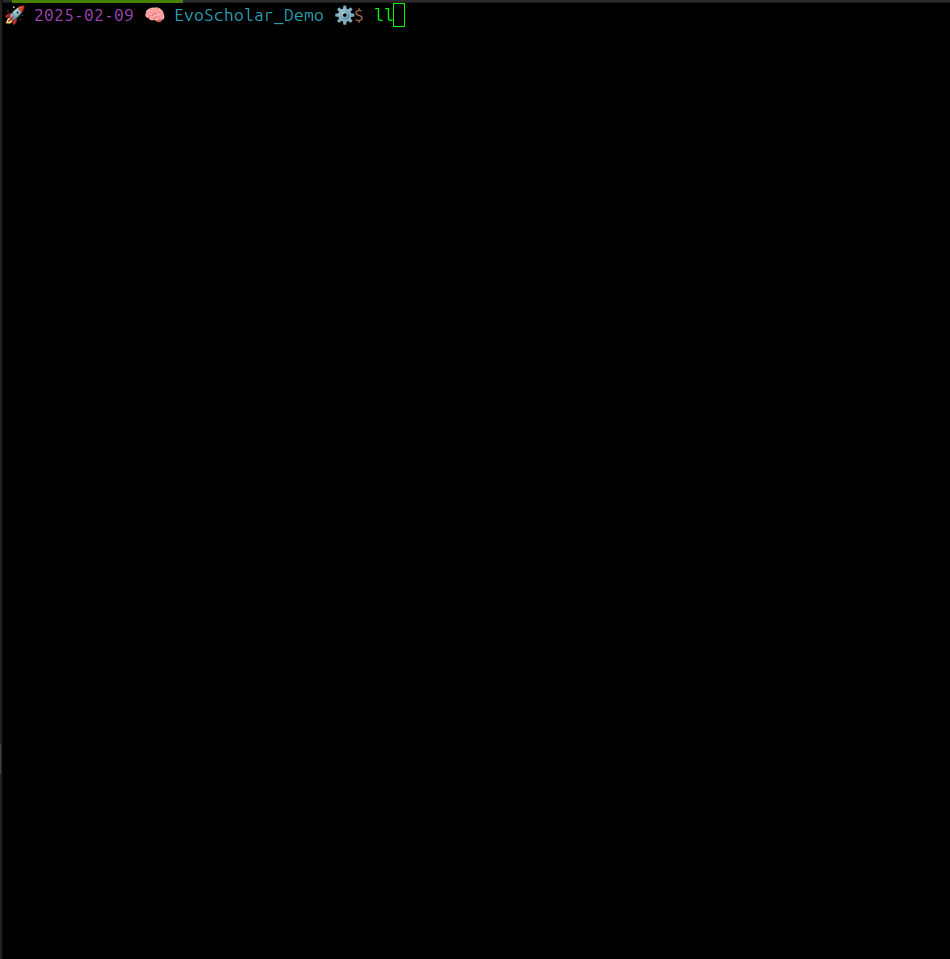

# EvoScholar 🚀🧠⚙️


EvoScholar is a self-improving research agent designed to generate concise, interdisciplinary research papers. By fetching the latest arXiv paper summaries and blending concepts from diverse STEM fields, EvoScholar synthesizes innovative research ideas and iteratively refines them through feedback loops.

## Demo

[](https://i.imgur.com/IRvSRYm.mp4)

*If the image does not display properly, [click here](https://i.imgur.com/IRvSRYm.mp4) to view the demo.*

## Idea Behind the Project

- **Automated Insight Extraction:** Retrieves recent research abstracts from arXiv, identifying emerging trends across various STEM fields.
- **Interdisciplinary Synthesis:** Blends diverse concepts to propose novel interdisciplinary research directions.
- **Iterative Refinement:** Evaluates generated research papers and refines them to improve clarity and conciseness.

## Project Structure

```text

.
├── assets
│   └── demo.png
├── generated_papers
├── LICENSE
├── README.md
├── requirements.txt
└── src
    ├── evo_scholar.py
    ├── generated_paper.txt
    ├── __init__.py
    ├── tests.py
    └── utils.py

4 directories, 9 files


```

## Installation

```bash
git clone https://github.com/yourusername/EvoScholar.git
cd EvoScholar
python3 -m venv venv
source venv/bin/activate  # On Windows: venv\Scripts\activate
pip install -r requirements.txt
export XAI_API_KEY="your_api_key_here"


## Usage

```bash

python src/evo_scholar.py
The generated research paper will be saved in src/generated_paper.txt and the generated_papers directory.
```

## Testing
```bash

python src/tests.py
pytest  # If pytest is installed

```

## License
This project is licensed under the MIT License.

## Contributing
Contributions, suggestions, and improvements are welcome!
Feel free to open issues or submit pull requests. Please fork to contribute if possible!

Thank you for checking out my project. I hooe you can generate some cool new ideas!
